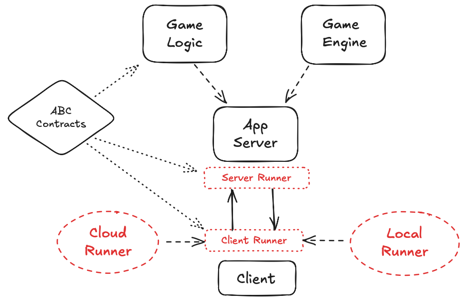

# game-framework-runners



The `game-runners` package provides the transport layer between the game UI and the game logic core. It implements client and server runner interfaces defined in `game-framework-contracts`, handling HTTP communication, HMAC message signing, metadata management, and retry logic.

Two deployment targets are provided: **local** (polling against a FastAPI app-server at `localhost:8000`) and **cloud** (stub implementations, not yet complete).

## Repository Structure

```
src/runners/
├── local/
│   ├── client_runner.py     # LocalRunnerClient — UI-side HTTP transport
│   ├── server_runner.py     # LocalRunnerServer — logic-side HTTP transport
│   └── metadata_runner.py   # GameMetadataHandler — local game/player metadata
├── cloud/
│   ├── client_runner.py     # CloudRunnerClient — stub (not yet implemented)
│   ├── server_runner.py     # CloudRunnerServer — stub (not yet implemented)
│   └── metadata_runner.py   # GameMetadataHandler — stub (not yet implemented)
└── utils/
    ├── hmacsigner.py        # HMAC-SHA256 message signing and verification
    └── retries.py           # Retry decorator and safe_get/safe_post helpers
```

## Prerequisites

- Python 3.12+
- [Pipenv](https://pipenv.pypa.io/)
- Built `game-contracts` package (see `game-framework-contracts` repo)

## Local Setup

```bash
# Build the contracts package first (from game-framework-contracts repo)
make build

# Install dependencies
pipenv install

# Activate the virtual environment
pipenv shell
```

See [docs/LOCAL_DEVELOPMENT.md](docs/LOCAL_DEVELOPMENT.md) for full setup and usage instructions.

## Usage

Import the runner for your deployment target:

```python
from runners.local.client_runner import LocalRunnerClient
from runners.local.server_runner import LocalRunnerServer
```

Both classes implement the `RunnerClientABC` / `RunnerServerABC` interfaces from `game-framework-contracts`.

## Related Repos

- [Game Framework - App Server](https://github.com/threnjen/game-framework-app-server)
- [Game Framework - Contracts](https://github.com/threnjen/game-framework-contracts)
- [Sample Game UI](https://github.com/threnjen/sample-game-ui)
- [Sample Game Logic](https://github.com/threnjen/sample-game-logic)

## Further Documentation

- [Architecture](docs/ARCHITECTURE.md)
- [Local Development](docs/LOCAL_DEVELOPMENT.md)
- [Codebase Context](docs/CODEBASE_CONTEXT.md)
- [Troubleshooting](docs/TROUBLESHOOTING.md)