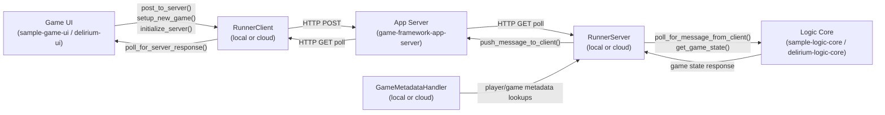

# Architecture: game-framework-runners

## Overview

`game-runners` is the transport layer of the Delirium game framework. It mediates all communication between the game UI and the game logic core by implementing abstract interfaces defined in `game-framework-contracts`. The package ships two deployment targets — **local** and **cloud** — each providing identical runner classes behind the same ABC surface.

---

## Component Diagram



---

## Components

### `runners/local/`

Fully implemented runners that communicate via HTTP polling against the FastAPI app-server running at `http://localhost:8000`.

| Class | Implements | Role |
|---|---|---|
| `LocalRunnerClient` | `RunnerClientABC` | UI-side transport: posts moves, polls for server responses |
| `LocalRunnerServer` | `RunnerServerABC` | Logic-side transport: polls for client messages, pushes state updates |
| `GameMetadataHandler` | `GameMetadataHandlerABC` | In-memory game/player metadata with placeholder persistence |

### `runners/cloud/`

Stub implementations of the same three classes. Method signatures match the ABCs but bodies are empty (`...`). Intended for future cloud transport (e.g., AWS SQS, API Gateway).

### `runners/utils/`

Shared utilities used by both local and cloud runners.

| Module | Purpose |
|---|---|
| `hmacsigner.py` | Signs and verifies `MessageEnvelope` payloads using HMAC-SHA256 |
| `retries.py` | `retry_on_exception` decorator + `safe_get`/`safe_post` wrappers with exponential backoff |

---

## Message Flow

All messages are wrapped in a `MessageEnvelope` (Pydantic model from `game-framework-contracts`):

```
MessageEnvelope
  game_id    : str
  client_id  : str
  source     : MessageSource  # "client" or "server"
  seq        : int            # monotonic sequence number (replay protection)
  signature  : str | None     # HMAC-SHA256 hex digest
  payload    : dict
```

The `LocalRunnerServer` validates every inbound envelope:
1. `client_id` must be in the registered players list (from `GameMetadataHandler`)
2. HMAC signature must verify against the shared secret
3. `seq` must not be less than the last seen sequence number (replay detection)

---

## Key Design Decisions

- **Polling over webhooks** — the local runner uses client-initiated HTTP polling rather than websockets or push notifications, keeping the app-server stateless.
- **Target-based package layout** — `local/` and `cloud/` mirror each other structurally so callers can swap implementations by changing only the import path.
- **HMAC signing on the client** — `LocalRunnerClient` signs outgoing envelopes; `LocalRunnerServer` verifies them, ensuring message integrity across the HTTP boundary.
- **Metadata handler is separate** — game/player metadata lookups are isolated in `GameMetadataHandler` rather than embedded in the runner, following the `GameMetadataHandlerABC` contract.

---

## External Dependencies

| Dependency | Use |
|---|---|
| `game-contracts` | Abstract base classes and `MessageEnvelope` / `MessageSource` models |
| `requests` / `httpx` | Synchronous and async HTTP in the local runners |
| `fastapi` | Listed as a dependency; used indirectly via the app-server |
| `boto3` | Declared in `pyproject.toml` for future cloud runner implementation |
